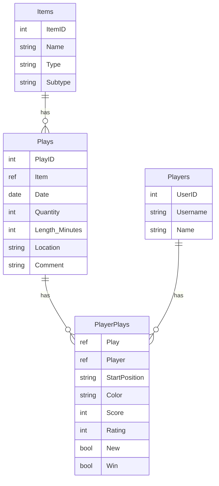

# Grist table schemas

```mermaid
erDiagram
    Items {
        int ItemID
        string Name
        string Type
        string Subtype
    }

    Players {
        int UserID
        string Username
        string Name
    }

    Plays {
        int PlayID
        ref Item
        date Date
        int Quantity
        int Length_Minutes
        string Location
        string Comment
    }

    PlayerPlays {
        ref Play
        ref Player
        string StartPosition
        string Color
        int Score
        int Rating
        bool New
        bool Win
    }

    Items ||--o{ Plays : "has"
    Plays ||--o{ PlayerPlays : "has"
    Players ||--o{ PlayerPlays : "has"
```
